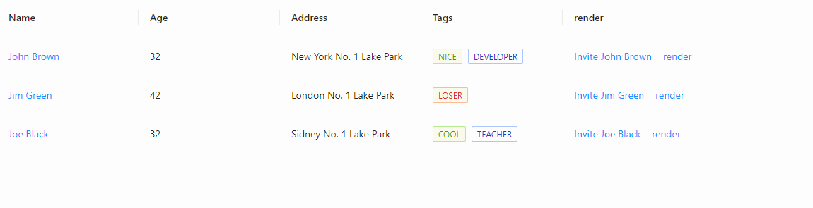

# use-antd-resizable-header

> antd 表格头拖拽 Hook，兼容 Table ProTable

## 预览



## 在线地址

[codesandbox](https://codesandbox.io/s/silly-dream-rq89l?file=/src/App.tsx)

## 安装

```bash
yarn add use-antd-resizable-header
```

## 注意事项

- **默认拖动颜色为`#000`，可通过`global`或设置 css 变量`--arh-color`设置颜色**
- **至少一列不能拖动（width 不设置即可），[请保持最后至少一列的自适应](https://ant-design.gitee.io/components/table-cn/#components-table-demo-fixed-columns)**
- **若 column 未传入`dataIndex`，请传入一个唯一的`key`，否则按照将按照 column 的序号 index 计算唯一 key**
- **若 column 有副作用，请把依赖项传入 useMemo deps 中**
- **remenber import style**

## Example

```tsx
import useARH from 'use-antd-resizable-header';
import 'use-antd-resizable-header/dist/style.css';

function App() {
  const columns = [];

  const { components, resizableColumns, tableWidth } = useARH({
    columns: useMemo(() => columns, []),
  });

  return (
    <>
      <Table
        columns={resizableColumns}
        components={components}
        dataSource={data}
        scroll={{ x: tableWidth }}
      ></Table>
      <ProTable
        columns={resizableColumns}
        components={components}
        dataSource={data}
        scroll={{ x: tableWidth }}
      ></ProTable>;
    </>
  );
}
```

## 基本用例

```css
/* index.css */
--arh-color: red;
```

```tsx
import React, { useReducer } from 'react';
import { Table, Tag, Space } from 'antd';
import useARH from 'use-antd-resizable-header';
import 'antd/dist/antd.css';
import 'use-antd-resizable-header/dist/style.css';

const data = [
  {
    key: '1',
    name: 'John Brown',
    age: 32,
    address: 'New York No. 1 Lake Park',
    tags: ['nice', 'developer'],
  },
  {
    key: '2',
    name: 'Jim Green',
    age: 42,
    address: 'London No. 1 Lake Park',
    tags: ['loser'],
  },
  {
    key: '3',
    name: 'Joe Black',
    age: 32,
    address: 'Sidney No. 1 Lake Park',
    tags: ['cool', 'teacher'],
  },
];

const Hello: React.FC = () => {
  const [, forceRender] = useReducer((s) => s + 1, 0);
  const [deps, setDeps] = useState(0);

  const columns = [
    {
      title: 'Name',
      dataIndex: 'name',
      key: 'name',
      width: 300,
      ellipsis: true,
      render: (text) => (
        <a onClick={() => setDeps((t) => t + 1)}>
          {text}
          {deps}
        </a>
      ),
    },
    {
      title: 'Age',
      dataIndex: 'age',
      key: 'age',
      ellipsis: true,
      width: 200,
    },
    {
      title: 'Address',
      dataIndex: 'address',
      key: 'address',
      ellipsis: true,
      width: 200,
    },
    {
      title: 'Tags',
      key: 'tags',
      dataIndex: 'tags',
      width: 200,
      ellipsis: true,
      render: (tags) => (
        <>
          {tags.map((tag) => {
            let color = tag.length > 5 ? 'geekblue' : 'green';
            if (tag === 'loser') {
              color = 'volcano';
            }
            return (
              <Tag color={color} key={tag}>
                {tag.toUpperCase()}
              </Tag>
            );
          })}
        </>
      ),
    },
    {
      title: 'render',
      key: 'action',
      render: (text, record) => (
        <Space size="middle">
          <a>Invite {record.name}</a>
          <a
            onClick={() => {
              forceRender();
              alert('render');
            }}
          >
            render
          </a>
        </Space>
      ),
    },
  ];

  const { components, resizableColumns, tableWidth } = useARH({
    columns: useMemo(() => columns, [deps]),
    minConstraints: 50,
  });

  return (
    <Table
      columns={resizableColumns}
      components={components}
      dataSource={data}
      scroll={{ x: tableWidth }}
    />
  );
};

export default Hello;
```

## 基本用例 - 搭配 Typography 实现 title 溢出时 tooltip

```css
/* index.css */
--arh-color: red;
```

```tsx
// utils.tsx
export const genEllipsis = (text: string, copyable?: boolean, stopPropagation?: boolean) => {
  let _text = isNil(text) ? '' : String(text);

  if ([null, undefined, ''].includes(text)) _text = '-';

  return (
    <Typography.Text
      style={{
        width: '100%',
        margin: 0,
        padding: 0,
        color: 'inherit',
      }}
      onClick={(e) => (stopPropagation ? e?.stopPropagation() : null)}
      title=" "
      copyable={
        copyable && text
          ? {
              text,
              tooltips: ['', ''],
            }
          : undefined
      }
      ellipsis={text ? { tooltip: text } : false}
    >
      {_text}
    </Typography.Text>
  );
};
```

```tsx
// index.tsx
import ProTable from '@ant-design/pro-table'; // or import { Table } from 'antd'
import useARH from 'use-antd-resizable-header';
import { genEllipsis } from './utils.tsx';

import 'use-antd-resizable-header/dist/style.css';
import './index.css';

const columns: ProColumns[] = [
  {
    title: 'id',
    dataIndex: 'id',
    width: 300,
    ellipsis: true,
  },
  {
    title: 'name',
    dataIndex: 'name',
    ellipsis: true,
  },
];

const dataSource = [
  {
    id: 1,
    name: 'zhangsan',
  },
  {
    id: 2,
    name: 'lisi',
  },
];

function App() {
  const { resizableColumns, components, tableWidth } = useARH({
    columns: useMemo(() => columns, []),
  });

  let cols = [...resizableColumns];

  cols = columns.map((item) => ({
    ...item,
    title: genEllipsis(item.title as string, false, true),
  }));

  return (
    <ProTable
      columns={cols}
      components={components}
      scroll={{ x: tableWidth }}
      dataSource={dataSource}
    ></ProTable>
  );
}

export default App;
```

## 为什么需要 React.useMemo ?

### 如果不使用 useMemo

#### 组件 render => columns 引用变化 => use-antd-resiable-header render => 组件 render => columns 引用变化···

## 不使用 useMemo

可以采用其他阻止 render 的方案，如 `columns` 是 prop 或 常量

## MIT

[LICENSE](https://github.com/hemengke1997/useARH/blob/master/LICENSE)
