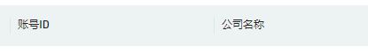

# use-antd-resizable-header

> antd 表格头拖拽 Hook，兼容 Table ProTable

## 预览



## 安装

```bash
yarn add use-antd-resizable-header
```

## 注意事项

- **columns 为常量时，提到组件外，或使用 `React.useMemo`, `React.Ref` 包裹常量**
- **默认拖动颜色为`#000`，可通过`global`或设置css变量`--atrh-color`设置颜色**
- **至少一列不能拖动（width不设置即可），[请保持最后至少一列的自适应](https://ant-design.gitee.io/components/table-cn/#components-table-demo-fixed-columns)**

## Example

```tsx
import useATRH from 'use-antd-resizable-header';
import 'use-antd-resizable-header/dist/style.css';

const columns = [];

function App() {
  const { components, resizableColumns, tableWidth } = useATRH({columns});

  return (
    <>
      <Table
        columns={resizableColumns}
        components={components}
        dataSource={data}
        scroll={{ x: tableWidth }}
      ></Table>
      <ProTable
        columns={resizableColumns}
        components={components}
        dataSource={data}
        scroll={{ x: tableWidth }}
      ></ProTable>;
    </>
  );
}
```

## 基本用例

```css
/* index.css */
--atrh-color: red;
```

```tsx
import ProTable from '@ant-design/pro-table'; // or import { Table } from 'antd'
import useATRH from 'use-antd-resizable-header';

import 'use-antd-resizable-header/dist/style.css';
import './index.css';

const columns: ProColumns[] = [
  {
    title: 'id',
    dataIndex: 'id',
    width: 300,
  },
  {
    title: 'name',
    dataIndex: 'name',
  },
];

const dataSource = [
  {
    id: 1,
    name: 'zhangsan',
  },
  {
    id: 2,
    name: 'lisi',
  },
];

function App() {
  const { resizableColumns, components, tableWidth } = useATRH({columns});

  return (
    <ProTable
      columns={resizableColumns}
      components={components}
      scroll={{ x: tableWidth }}
      dataSource={dataSource}
    ></ProTable>
  );
}

export default App;
```

## 基本用例 - 搭配 Typography 实现 title 溢出时 tooltip

```css
/* index.css */
--atrh-color: red;
```

```tsx
// utils.tsx
export const genEllipsis = (text: string, copyable?: boolean, stopPropagation?: boolean) => {
  let _text = isNil(text) ? '' : String(text);

  if ([null, undefined, ''].includes(text)) _text = '-';

  return (
    <Typography.Text
      style={{
        width: '100%',
        margin: 0,
        padding: 0,
        color: 'inherit',
      }}
      onClick={(e) => (stopPropagation ? e?.stopPropagation() : null)}
      title=" "
      copyable={
        copyable && text
          ? {
              text,
              tooltips: ['', ''],
            }
          : undefined
      }
      ellipsis={text ? { tooltip: text } : false}
    >
      {_text}
    </Typography.Text>
  );
};
```

```tsx
// index.tsx
import ProTable from '@ant-design/pro-table'; // or import { Table } from 'antd'
import useATRH from 'use-antd-resizable-header';
import { genEllipsis } from './utils.tsx';

import 'use-antd-resizable-header/dist/style.css';
import './index.css';

const columns: ProColumns[] = [
  {
    title: 'id',
    dataIndex: 'id',
    width: 300,
  },
  {
    title: 'name',
    dataIndex: 'name',
  },
];

const dataSource = [
  {
    id: 1,
    name: 'zhangsan',
  },
  {
    id: 2,
    name: 'lisi',
  },
];

function App() {
  const { resizableColumns, components, tableWidth } = useATRH({columns});

  let cols = [...resizableColumns];

  cols = columns.map((item) => ({
    ...item,
    title: genEllipsis(item.title as string, false, true),
  }));

  return (
    <ProTable
      columns={cols}
      components={components}
      scroll={{ x: tableWidth }}
      dataSource={dataSource}
    ></ProTable>
  );
}

export default App;
```

## MIT

[LICENSE](https://github.com/hemengke1997/useATRH/blob/master/LICENSE)
